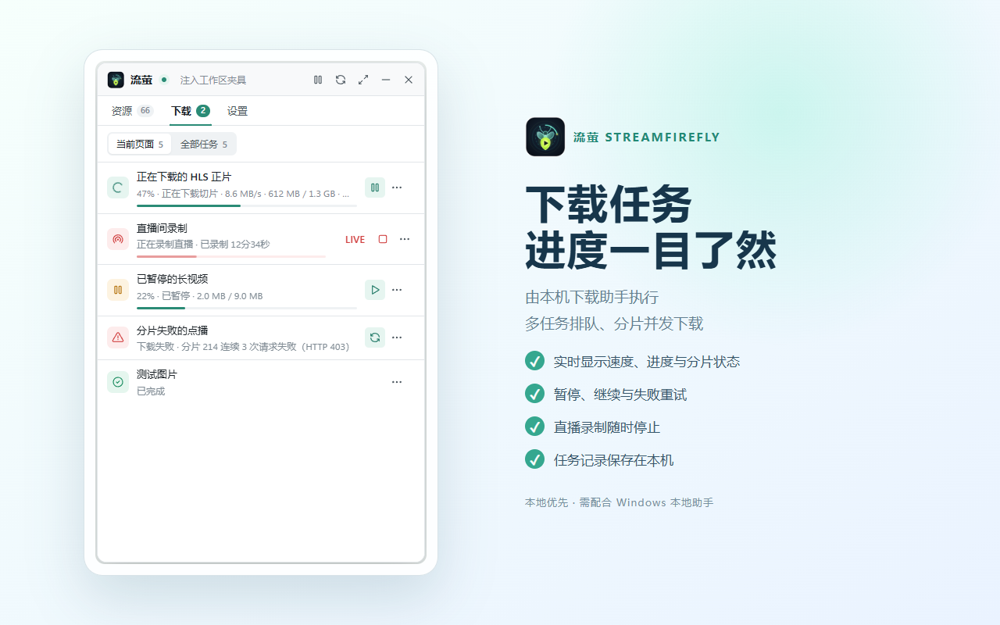
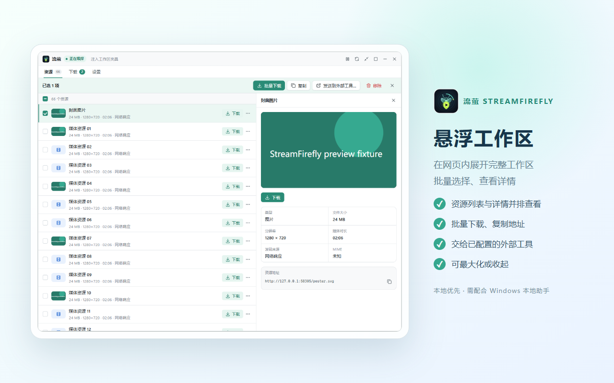
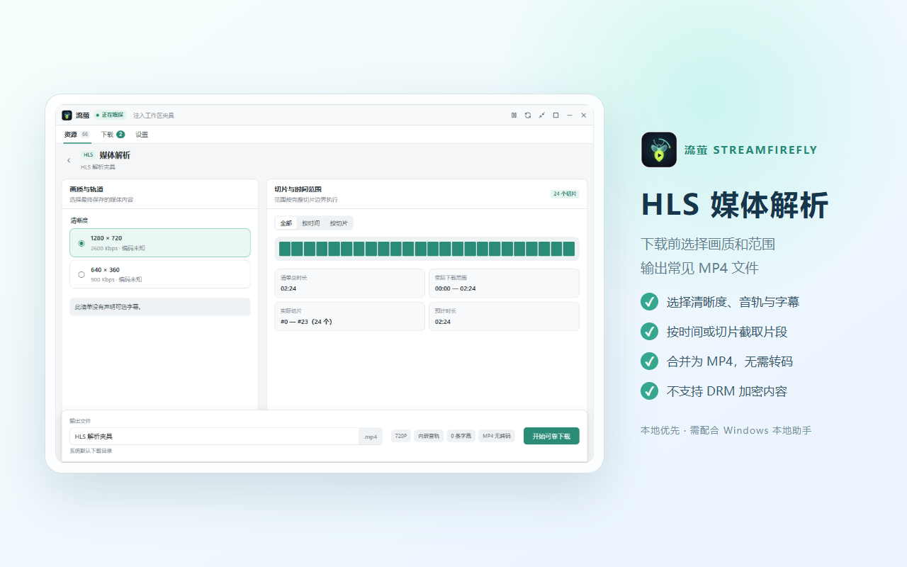
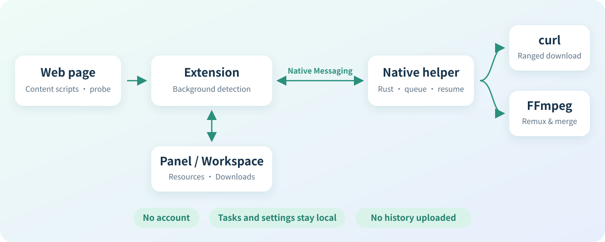

<div align="center">


# StreamFirefly

Local-first media discovery and download for the web

[](https://github.com/rumoii/streamfirefly/releases/latest)
[](https://github.com/rumoii/streamfirefly/releases)
[](https://github.com/rumoii/streamfirefly/stargazers)
[](LICENSE)


**[Download](https://github.com/rumoii/streamfirefly/releases/latest)** · [Installation guide](INSTALL.md) (Chinese) · [Usage](#usage) · [Privacy](PRIVACY.md) · [简体中文](README.md)

</div>

StreamFirefly has two parts: a browser extension and a native helper for Windows. The extension finds video, audio, images and HLS/DASH manifests on web pages. The helper, written in Rust, handles downloading, queueing, recovery and FFmpeg merging. Tasks and settings stay on your machine.

The current version is 1.0.5. The interface is currently in Simplified Chinese. StreamFirefly does not circumvent DRM; only download content you own or are authorized to download.

StreamFirefly ships in two editions built from the same source:

- **General edition**: no site restrictions. Distributed through GitHub Releases with the Chrome/Edge extension, the signed Firefox add-on and the Windows native helper. Whether a site can be detected and downloaded still depends on the site.
- **Chrome Web Store edition**: following Chrome Web Store policy, it does not detect or download YouTube content. (Still under review, so it may not be found in the store yet.)

## Features

- Finds media URLs in network requests, response types, media elements, JSON/text bodies and inline scripts, and parses HLS manifests that pages build in memory through POST, Blob or script. Manifests that loaded before StreamFirefly was opened are picked up from the page's resource timing when you open it.
- Downloads plain files over 1–16 parallel Range connections and resumes each part after a pause. Falls back to a single connection when the server does not support ranges.
- For HLS, choose the quality, external audio, subtitles and a time or segment range. Standard AES-128 is supported. Streams are merged without re-encoding; audio-only streams are saved as M4A.
- Records HLS live streams, with manual start, pause and stop.
- Downloads DASH on demand (experimental): one video and one audio track, saved as MP4 or MKV.
- Queues tasks in order and runs at most two at a time. Recoverable tasks continue automatically after the helper restarts.
- Opens a draggable, resizable panel inside the current page from the toolbar button, which can expand into a larger workspace. Follows the system light or dark theme.
- Optional: detection rules, URL extraction, output templates, sending to external tools (Aria2, HTTP services, local programs, custom protocols), deep search and cache capture.

## Screenshots

<table>
  <tr>
    <td align="center"><br>Resource list</td>
    <td align="center"><br>Download tasks</td>
  </tr>
  <tr>
    <td align="center"><br>Floating workspace</td>
    <td align="center"><br>HLS parser</td>
  </tr>
</table>

Screenshots come from the automated UI tests and show test data.

## Support

| Type | Status | Notes |
| --- | --- | --- |
| Plain HTTP files | Supported | Video, audio, images; parallel download, pause and resume |
| HLS on demand | Supported | Per-segment retry, checkpoints, recovery after restart |
| HLS AES-128 | Supported | The key is checked against the first segment before the rest are downloaded |
| HLS live | Supported | Start recording from the parser page; LL-HLS parts are not supported |
| DASH on demand | Experimental | Static, single-Period, unencrypted manifests only |
| Blob / MediaSource | Experimental | Cache capture saves what plays after capture starts |
| DRM, SAMPLE-AES | Not supported | Reported only, never circumvented |

<details>
<summary>Optional features</summary>

- Detection rules: match by extension, MIME type or URL pattern, limited by site and size, with exclusions applied first. Rules can be reordered, copied, imported and exported, and each match shows which rule caused it. Patterns and templates run in a Worker with a time limit.
- URL extraction: pulls the real media URL out of a request URL and lists it as a separate resource. Extracted resources do not inherit the original request's credentials and are never sent to external tools automatically.
- Output templates: separate copy templates for HLS, DASH and other resources, plus a file name template. Templates only transform strings; they never run scripts.
- External tools: a confirmation page shows the expanded arguments before sending and reports the result for each item. Clear failures can be retried by hand; unknown results are never resent automatically. Automatic sending applies only to sites you configured and to HTTP/Aria2 tools.
- Deep search: off by default, enabled per page, and can be remembered per site. Watches for complete HLS/MPD text passing through JSON.parse, Base64, text decoding and same-origin Workers. Possible AES-128 keys are kept in memory only and can be chosen in the HLS parser.
- Cache capture: pick a media source on the page and save MediaSource data from that point on. Seeks and codec changes start a new segment, each saved as its own MKV. Data buffered before capture started cannot be recovered.

</details>

## Installation

### One-click install (recommended)

1. Install the extension: the Chrome Web Store edition is still under review, so until it is approved install the general edition from the [installation guide](INSTALL.md) (in Chinese); other browsers use the same guide.
2. The settings page opens after installation. Click **复制安装命令** (copy install command), press <kbd>Win</kbd> + <kbd>R</kbd>, paste and press Enter.
3. The command downloads the native helper matching the extension version, verifies its SHA-256 and installs it for the current user without administrator rights. The extension then connects automatically.

### Manual install

Download the Windows bundle for your architecture from [Releases](https://github.com/rumoii/streamfirefly/releases/latest), then follow the [installation guide](INSTALL.md) (in Chinese).

### Build from source

You need Node.js, a Rust toolchain, and Chrome/Edge 141+ or Firefox 142+. The helper downloads with the `curl` that ships with Windows; HLS/DASH merging needs FFmpeg.

```powershell
npm install
npm run build:extension
cargo build --release --manifest-path native-host/Cargo.toml
```

1. Open `chrome://extensions`, turn on developer mode, load the `extension/` directory and note the extension ID.
2. Register the native helper:

   ```powershell
   .\tools\install-native-host.ps1 `
     -ChromeExtensionId '<Chrome extension ID>' `
     -FirefoxExtensionId 'streamfirefly@example.invalid'
   ```

3. Run the install script again after each rebuild of the helper, and click "Reload" on the extensions page after updating the extension.

## Usage

1. Open a page with video or audio and click the StreamFirefly toolbar button.
2. The Resources tab lists what has been found. Filter by name, type, size and duration; open an item to see its cover, a preview and the full URL.
3. Click Download to save it. For HLS/DASH, open the parser to choose quality, audio, subtitles and range. Select several items to download, copy or send them to an external tool together.
4. The Downloads tab shows progress and lets you pause, resume, retry or delete tasks.

By default, sniffing only runs while StreamFirefly is open. If the list is empty, play the video first. If it is still empty, reload the page and open StreamFirefly again, or set sniffing to "always" in the settings.

> **Tip: turn on deep search.** Deep search is off by default. When it is on, StreamFirefly also finds video manifests that pages generate with scripts, so more resources show up. On the Resources tab, click the radar icon in the toolbar → **开启深搜** (Turn on), then reload the page. Tick **记住此站点** (Remember this site) for sites you use often.

### Floating window

- The panel starts at 480×640px. The expanded workspace starts 1120px wide and 80% of the visible page tall, and shrinks when there is less room.
- Drag the title bar to move the window and drag an edge or corner to resize it. When collapsed, the small launcher snaps to the nearest side. Size and position are stored in the extension's local `floatingUiLayout` setting.
- Collapsing keeps the launcher and keeps sniffing, but stops previews in the panel. Closing removes the launcher; downloads that have started keep running.
- "Back to panel" in the title bar returns to the panel, and a maximized window can be restored. Inside the window, Escape closes an open menu or filter, then a dialog, then restores, returns to the panel or collapses. The page's own Escape handling is left alone.
- Each browser window has at most one in-page interface. Internal browser pages and restricted pages use the native sidebar instead, which explains that the page cannot be sniffed.
- In Firefox, expanding the workspace from the sidebar is subject to the sidebar's user-gesture rules. Opening the panel from the toolbar button also closes StreamFirefly's sidebar.

## How it works

<p align="center">
  
</p>

| Directory | Contents |
| --- | --- |
| `extension/` | Browser extension: background, content scripts, page probes and manifests |
| `extension-ui/` | Sidebar and in-page workspace UI (Vue 3) |
| `native-host/` | Native helper: protocol, task store, scheduler and HTTP/HLS/DASH downloads |
| `shared/` | Detection, extraction and template logic shared by the extension and the UI |
| `tools/` | Build, test and Windows installation scripts |
| `docs/` | Design decisions and development notes |

## Development

```powershell
npm install
npm run typecheck
npm run validate:extension   # build and validate the Chrome / Firefox extensions
npm run test:unit
npm run test:ui:browser      # UI tests with mocked APIs; screenshots in test-results/ui/
npm run verify:features      # includes cargo test and the native helper integration tests
```

<details>
<summary>Browser tests</summary>

These use isolated temporary profiles and leave your everyday browser data alone.

```powershell
npm run test:chrome
npm run test:firefox
npm run test:browsers        # Chrome, Edge and Firefox in turn
```

Set `CHROME_BINARY`, `EDGE_BINARY` or `FIREFOX_BINARY` to use a specific browser.

</details>

<details>
<summary>Native helper tests</summary>

```powershell
cargo test --manifest-path native-host/Cargo.toml
npm run test:native
```

`test:native` uses the debug build you just compiled and writes tasks to a temporary directory; set `STREAMFIREFLY_NATIVE_EXE` to test another build. In the HLS/DASH tests the native helper runs the minimal FFmpeg named by `STREAMFIREFLY_FFMPEG_EXE` (default `installer/build/x64/ffmpeg.exe`); fixtures are generated and inspected with the full FFmpeg and FFprobe from `tools/download-fixture-ffmpeg.ps1`, or those named by `STREAMFIREFLY_FIXTURE_FFMPEG_EXE` and `STREAMFIREFLY_FFPROBE_EXE`.

</details>

<details>
<summary>Packaging and release</summary>

```powershell
.\tools\package-extension.ps1 -Edition chrome-store   # Chrome Web Store upload package
.\tools\package-extension.ps1 -Edition general        # General-edition Chromium extension
npm run package:firefox              # unsigned Firefox XPI for testing
.\tools\package-release.ps1 -SignedFirefoxXpi '<signed XPI path>'
.\tools\build-installer.ps1 -Architecture x64
.\tools\build-installer.ps1 -Architecture arm64
.\tools\prepare-release.ps1 -ChromeExtensionId '<extension ID assigned by the store>'
```

- Release packages require a clean source commit and its matching signed Firefox XPI. Legacy beta tools are not the release entry point.
- Building the installer needs Inno Setup 6. The bundled FFmpeg is a minimal LGPL build produced by `tools/ffmpeg/build.sh`, downloaded and checked against a fixed SHA-256; it is not committed to the repository.
- The local development extension ID is `gimoeapmpoeogpabfdplccplmmohklff`; do not use it for installers you hand out. Firefox always uses `streamfirefly@example.invalid`.
- Store submission material is in `store-assets/`.

</details>

## Upgrades and data

- Upgrade and roll back the extension and the native helper together. Reloading the extension alone does not update an installed helper.
- Before upgrading, wait for tasks to finish and back up `%LOCALAPPDATA%\StreamFirefly\tasks.json`, the `tasks` folder next to it, and your downloaded files.
- If the task file has an unknown version or is damaged, the helper stops writing instead of overwriting it with an empty list. Keep the original file for troubleshooting rather than deleting it.

## Documentation

Most documents are in Chinese.

- [Installation guide](INSTALL.md)
- [Privacy policy](PRIVACY.md)
- [DASH on-demand notes](docs/development/dash-vod.md)
- [Modular discovery and tool integration](docs/development/modular-discovery.md)
- [External tools and URL extraction](docs/development/tools-and-extraction.md)
- [Design decisions](docs/decisions/README.md)
- [Release notes](docs/releases/1.0.5.md)

## Privacy

Cookies and Authorization headers are kept in memory only while a download runs and are never written to task records. Cache capture only saves data from after capture starts and does not read the browser cache. See the [privacy policy](PRIVACY.md).

## Star history

<a href="https://star-history.com/#rumoii/streamfirefly&Date">
  <picture>
    <source media="(prefers-color-scheme: dark)" srcset="https://api.star-history.com/svg?repos=rumoii/streamfirefly&type=Date&theme=dark">
    
  </picture>
</a>

## Acknowledgements

StreamFirefly uses [Vue](https://github.com/vuejs/core), [Pinia](https://github.com/vuejs/pinia), [hls.js](https://github.com/video-dev/hls.js), [Tabler Icons](https://github.com/tabler/tabler-icons), [curl](https://curl.se/) and [FFmpeg](https://ffmpeg.org/). See [THIRD_PARTY_NOTICES.md](extension/THIRD_PARTY_NOTICES.md) for third-party licenses and [installer/FFMPEG-SOURCE.txt](installer/FFMPEG-SOURCE.txt) for FFmpeg's source.
