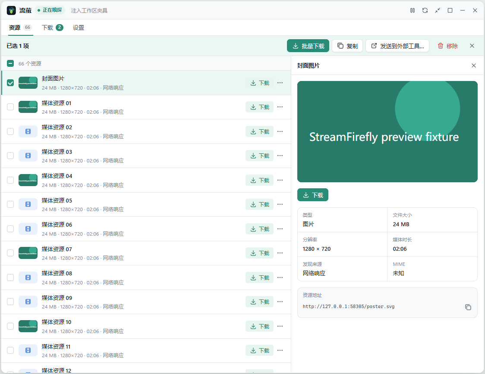
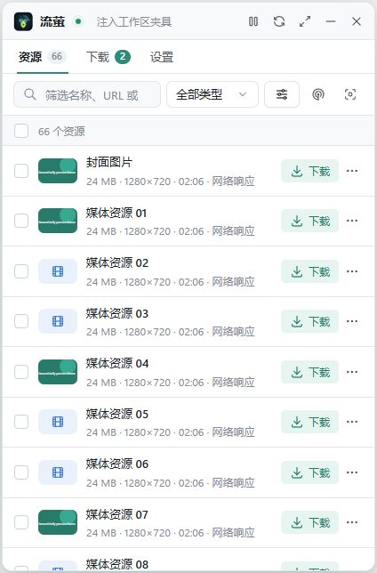
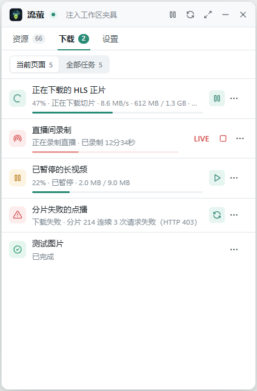
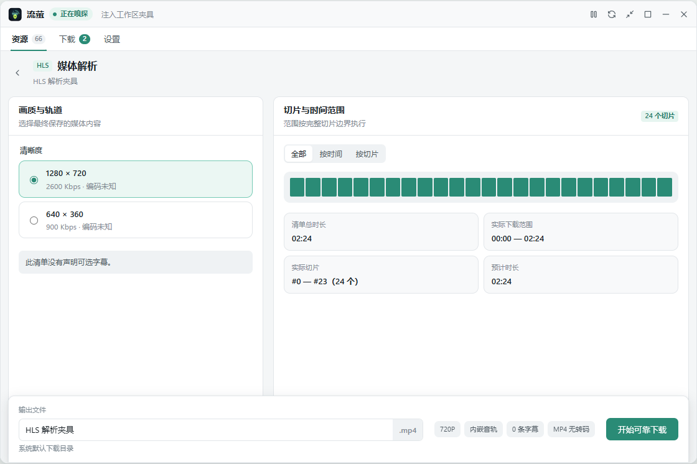
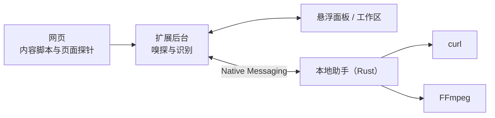

<div align="center">


# 流萤 StreamFirefly

本地优先的网页媒体发现与下载工具

简体中文 | [English](README.en.md)

</div>

<p align="center">
  
</p>

流萤由浏览器扩展和 Windows 本地助手两部分组成。扩展在网页里发现视频、音频、图片和 HLS/DASH 清单；本地助手用 Rust 编写，负责下载、排队、断点恢复和 FFmpeg 合并。任务和设置只保存在本机。

项目目前处于 0.10.0 内测阶段，只通过受邀渠道分发。流萤不绕过 DRM，请只下载你拥有版权或已获授权的内容。

## 功能

- 从网络请求、响应类型、媒体元素、JSON/文本和内联脚本中识别媒体地址，也能解析页面用 POST、Blob 或脚本在内存中生成的 HLS 清单。打开流萤之前已经加载的清单，会在打开时从页面资源时序中补录。
- 普通文件支持 1–16 路 Range 并发下载，暂停后按分段续传；服务器不支持分段时回退单连接。
- HLS 可选择清晰度、外部音轨、多字幕和时间或切片范围，支持标准 AES-128；合并时不转码，纯音频输出 M4A。
- HLS 直播可以手动开始、暂停和停止保存。
- DASH 点播（实验性）可选择一条视频和一条音轨，输出 MP4 或 MKV。
- 任务按先后顺序排队，最多同时下载 2 个；本地助手重启后，可恢复的任务会自动继续。
- 点击工具栏图标后，在当前网页打开可拖动、可缩放的悬浮面板，需要时展开为工作区；配色跟随系统深浅色。
- 可选功能：识别规则、URL 提取、输出模板、发送到外部工具（Aria2、HTTP 服务、本机程序、自定义协议）、深度搜索和缓存捕捉。

## 截图

<table>
  <tr>
    <td align="center"><br>悬浮面板 · 资源</td>
    <td align="center"><br>悬浮面板 · 下载</td>
  </tr>
  <tr>
    <td align="center" colspan="2"><br>HLS 解析页</td>
  </tr>
</table>

截图来自自动化界面测试，资源为测试数据。

## 支持范围

| 类型 | 状态 | 说明 |
| --- | --- | --- |
| 普通 HTTP 文件 | 支持 | 视频、音频、图片；并发下载、暂停续传 |
| HLS 点播 | 支持 | 切片级重试、检查点与重启恢复 |
| HLS AES-128 | 支持 | 批量下载前先用第一个切片验证密钥 |
| HLS 直播 | 支持 | 在解析页单独开始录制；不支持 LL-HLS Part |
| DASH 点播 | 实验性 | 仅静态、单 Period、非加密清单 |
| Blob / MediaSource | 实验性 | 通过缓存捕捉保存开始捕捉之后播放的数据 |
| DRM、SAMPLE-AES | 不支持 | 只提示，不绕过 |

<details>
<summary>可选功能说明</summary>

- 识别规则：按后缀、MIME 或 URL 正则匹配，可限定站点和大小，排除规则优先；支持排序、复制、导入导出，并显示命中原因。正则和模板在有超时限制的 Worker 中运行。
- URL 提取：从请求地址中提取真实媒体地址，作为单独的资源显示。提取出的资源不继承原请求的凭据，也不会自动发送到外部工具。
- 输出模板：HLS、DASH 和其他资源可分别设置复制模板，另有文件名模板。只做字符串变换，不执行脚本。
- 外部工具：发送前在确认页预览展开后的参数，并逐项显示结果。明确失败的可以手动重试，结果未知的不会自动重发。自动发送只对配置过的站点和 HTTP/Aria2 工具生效。
- 深度搜索：默认关闭，按页面开启，可记住站点。会观察 JSON.parse、Base64、文本解码和同源 Worker 中出现的完整 HLS/MPD 文本。发现的疑似 AES-128 密钥只保存在内存中，可在 HLS 解析页选用。
- 缓存捕捉：选择页面上的媒体源，保存开始捕捉之后的 MediaSource 数据。跳转或编码变化会另起一段，各自输出 MKV。开始捕捉之前已经缓冲的数据无法补回。

</details>

## 安装

### 内测包

受邀测试者请按[内测包安装指南](README-INTERNAL.md)操作。扩展和本地助手必须来自同一批次。

### 从源码构建

需要 Node.js、Rust 工具链，以及 Chrome/Edge 141+ 或 Firefox 142+。本地助手使用 Windows 自带的 `curl` 下载，HLS/DASH 合并需要 FFmpeg。

```powershell
npm install
npm run build:extension
cargo build --release --manifest-path native-host/Cargo.toml
```

1. 在 `chrome://extensions` 开启开发者模式，加载 `extension/` 目录，记下扩展 ID。
2. 注册本地助手：

   ```powershell
   .\tools\install-native-host.ps1 `
     -ChromeExtensionId '<Chrome 扩展 ID>' `
     -FirefoxExtensionId 'streamfirefly@example.invalid'
   ```

3. 每次重新编译本地助手后需要再运行一次安装脚本；扩展更新后在扩展管理页点击“重新加载”。

## 使用

1. 打开有视频或音频的网页，点击工具栏中的流萤图标。
2. “资源”页列出已发现的媒体，可以按名称、类型、大小和时长筛选；点开一项可以看到封面、预览和完整地址。
3. 点击“下载”保存。HLS/DASH 可以进入解析页选择画质、音轨、字幕和范围；勾选多项后可以批量下载、复制或发送到外部工具。
4. “下载”页显示进度，可以暂停、继续、重试或删除任务。

默认只在流萤打开时嗅探。列表为空时先播放一下视频；还是没有的话，刷新网页后重新打开流萤，或在设置里把嗅探时机改为“始终嗅探”。

### 悬浮窗口操作

- 面板初始尺寸为 420×640px；展开的工作区初始宽 1120px、高为可见网页的 80%，空间不够时自动缩小。
- 拖动标题栏移动窗口，拖动边缘或角落调整大小；收起后的小入口会贴靠最近的左右边缘。尺寸和位置保存在扩展本地配置 `floatingUiLayout` 中。
- 收起后保留小入口并继续嗅探，面板中的预览会停止；关闭后入口消失，已经开始的下载继续进行。
- 标题栏的“返回面板”回到快速面板，最大化后可以还原。在窗口内按 Escape，会依次关闭菜单或筛选弹层、对话框，再还原、返回面板或收起；不会拦截网页自己的 Escape。
- 每个浏览器窗口最多只有一个网页内界面。浏览器内部页面和受限页面会改用原生侧栏，提示该页无法嗅探。
- Firefox 从侧栏展开网页工作区时，受侧栏的用户手势限制；直接点击工具栏图标打开面板时，会同时关闭流萤的侧栏。

## 工作原理



| 目录 | 内容 |
| --- | --- |
| `extension/` | 浏览器扩展：后台、内容脚本、页面探针和清单 |
| `extension-ui/` | 侧栏与网页内工作区界面（Vue 3） |
| `native-host/` | 本地助手：协议、任务存储、调度和 HTTP/HLS/DASH 下载 |
| `shared/` | 扩展与界面共用的识别、提取和模板逻辑 |
| `tools/` | 构建、测试和 Windows 安装脚本 |
| `docs/` | 设计决策与开发说明 |

## 开发

```powershell
npm install
npm run typecheck
npm run validate:extension   # 构建并校验 Chrome / Firefox 扩展
npm run test:unit
npm run test:ui:browser      # 界面测试，使用模拟 API，截图在 test-results/ui/
npm run verify:features      # 包括 cargo test 和本地助手集成测试
```

<details>
<summary>浏览器测试</summary>

使用独立的临时配置，不影响日常浏览器数据。

```powershell
npm run test:chrome
npm run test:firefox
npm run test:browsers        # 依次运行 Chrome、Edge、Firefox
```

浏览器路径可以用 `CHROME_BINARY`、`EDGE_BINARY`、`FIREFOX_BINARY` 指定。

</details>

<details>
<summary>本地助手测试</summary>

```powershell
cargo test --manifest-path native-host/Cargo.toml
npm run test:native
```

`test:native` 默认使用刚编译的 debug 版本，任务写入临时目录；可以用 `STREAMFIREFLY_NATIVE_EXE` 指定其他版本。HLS/DASH 测试需要 x64 的 FFmpeg 和 FFprobe，放在 `installer/build/x64/`，或用 `STREAMFIREFLY_FFMPEG_EXE`、`STREAMFIREFLY_FFPROBE_EXE` 指定。

</details>

<details>
<summary>打包与发布</summary>

```powershell
.\tools\package-extension.ps1        # Chrome Web Store 上传包
npm run package:firefox              # Firefox 测试用 XPI（未签名）
.\tools\package-internal-test.ps1    # x64 / ARM64 内测包
.\tools\build-installer.ps1 -Architecture x64
.\tools\build-installer.ps1 -Architecture arm64
.\tools\prepare-release.ps1 -ChromeExtensionId '<商店分配的扩展 ID>'
```

- 内测包默认要求工作区没有未提交的改动。本地验收时可以加 `-AllowDirtySource`，但这样打出的包不能用于正式发布。
- 安装包构建需要 Inno Setup 6。FFmpeg 在构建时按固定地址和 SHA-256 下载，不提交到仓库。
- 本地开发用的扩展 ID 是 `gimoeapmpoeogpabfdplccplmmohklff`，不要用它构建对外发布的安装包。Firefox 固定使用 `streamfirefly@example.invalid`。
- 商店提交材料在 `store-assets/`。

</details>

## 升级与数据

- 扩展和本地助手需要一起升级、一起回滚。只重新加载扩展不会更新已安装的本地助手。
- 升级前先等任务结束，备份 `%LOCALAPPDATA%\StreamFirefly\tasks.json`、同目录下的 `tasks` 文件夹和已下载的文件。
- 如果任务文件版本未知或已损坏，本地助手会停止写入，不会用空列表覆盖它。遇到这种情况请保留原文件排查，不要直接删除。

## 文档

- [内测包安装指南](README-INTERNAL.md)
- [隐私政策](PRIVACY.md)
- [DASH 点播开发说明](docs/development/dash-vod.md)
- [模块化发现与工具集成](docs/development/modular-discovery.md)
- [外部工具与 URL 提取](docs/development/tools-and-extraction.md)
- [设计决策](docs/decisions/README.md)
- [版本说明](docs/releases/)

## 隐私

Cookie 和 Authorization 只在下载过程中保存在内存里，不写入任务记录。缓存捕捉只保存开始捕捉之后的数据，不读取浏览器缓存。详见[隐私政策](PRIVACY.md)。

## 致谢

流萤使用了 [Vue](https://github.com/vuejs/core)、[Pinia](https://github.com/vuejs/pinia)、[hls.js](https://github.com/video-dev/hls.js)、[Tabler Icons](https://github.com/tabler/tabler-icons)、[curl](https://curl.se/) 和 [FFmpeg](https://ffmpeg.org/)。第三方许可见 [THIRD_PARTY_NOTICES.md](extension/THIRD_PARTY_NOTICES.md)，FFmpeg 来源见 [installer/FFMPEG-SOURCE.txt](installer/FFMPEG-SOURCE.txt)。
